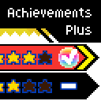

# Achievements Plus

New achievements to complete, Rewards for completing, and, Your achievements made by the Community. Dilute your gray days in the game with a new experience of exploring achievements!

## List of features:

* New exciting 53 achievements ported from RETROACHIEVEMENTS.ORG.

* Incredibly cool menu, based on the design of the Sonic Origins game collection.

* The player's Coins reward system for completing achievements.

* Discord RPC Support.

* Mod options for costuming the menu hot-keys, Coins HUD, and more.

* The Achievements system allows other mods to use it to create their own unique and incredibly exciting achievements to complete.

* The Coins system allows other mods to use them to unlock secret or additional items.

## Achievements:

This mod improves your gaming experience by introducing as many as 53 new exciting achievements into the game. Go to the Achievements menu by pressing the [X] button in the Data Select menu, and go to the RETROACHIEVEMENTS tab to track your progress.

All these achievements are unique and interesting in their own way. Some of them you will get as you progress through the levels, and for some you will have to do level research, or hone your skills to complete them.

## Coins: 

In addition to achievements, here is a player reward system - Coins, which you can get by completing and claim achievements. The amount of reward varies depending on the difficulty of the achievement.

You can use your Coins to buy unlockable items in supported mods.

## Discord RPC:

Let everyone know how many achievements you have completed and how many Coins you have now.

The Achievements menu in RPC will show the total value of completed / all achievements, and the current value of Coins. In addition, it will show which achievement you have currently selected in the menu, and will show its stars and completion status.

During the main gameplay, when completing an achievement, the RPC will show which achievement you have completed and how many stars it has.

## Modding:

Also, despite all the basic features of the mod, we provide opportunities for other modders to use our functions in their mods. This means that other mods can create their own custom achievements, add them to the list in the menu, and set their own conditions for completion.

Achievements Plus is happy to provide all the tools and documentation for using our features and functions. Check out the tutorials of <a href="https://github.com/fadeinside/s3air-achievements-plus/wiki/(Tutorial)-How-do-use-Coins-system#conclusion">How to use Coins system</a> and <a href="https://github.com/fadeinside/s3air-achievements-plus/wiki/(Tutorial)-How-to-create-Community-achievements">How to create custom Achievements</a> right now on GitHub Wiki!

Any mod that provides Community achievements should be installed above.

For other useful information, check out the <a href="https://github.com/fadeinside/s3air-achievements-plus/wiki">GitHub Wiki</a> page. If you have any questions, please contact the *#modding-discussion* or a separate official thread *#achievements-plus* on the Discord Sonic 3 A.I.R. Community server.

## Compatibility notes:

This mod makes changes to some parts of the script of various objects and loading scenes, but always calls the base function. Therefore, in order to avoid compatibility issues, use this mod in priority to most mods.

1. <a href="https://gamebanana.com/skins/173571">Accurate Sonic 2 HUD</a> can be installed in any order.

2. Any mod that provides Community achievements should be installed above this mod.

3. <a href="https://gamebanana.com/mods/362325">Blue Sphere Time Attack</a>, <a href="https://gamebanana.com/mods/151029">Sonic 3: D.A. Garden Edition</a>, <a href="https://gamebanana.com/mods/366547">Save Zone Act</a>, or any script mod should be installed below this mod so as to avoid compatibility issues.

## FAQ:

Q. I noticed a bug, where can I contact?  
A. Contact me in the comments of Gamebanana, GitHub issues, or via Discord on the Sonic 3 A.I.R Community server. Try to describe the problem in more detail.